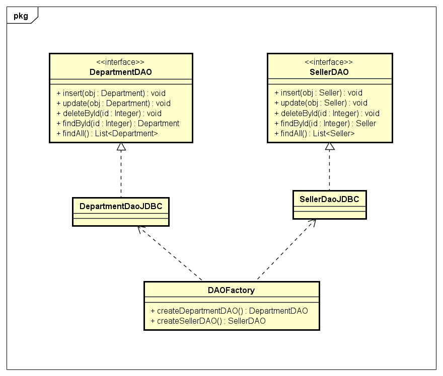
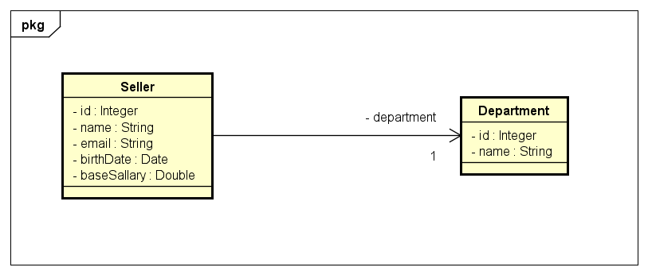

# Acesso a banco de dados com JDBC
JDBC (Java Database Connectivity): API padrão do Java para acesso a dados

## API JDBC

### Recuperar dados

- Statement - junto com a conexão cria um estado para receber uma query
- ResultSet - objeto que contém a tabela resultado da query executada no Statement
  - first()       [move para posição 1, se houver]
  - beforeFirst() [move para posição 0]
  - next()        [move para o próximo, retorna false se já estiver no último]
  - absolute(int) [move para a posição dada, lembrando que dados reais começam em 1]

### Inserir dados

- PreparedStatement - recebe a query a ser executada no banco
- executeUpdate - executa o PreparedStatement
- Statement.RETURN_GENERATED_KEYS - parametro para retornar chaves dos registros inseridos
- getGeneratedKeys - responsável por receber as chaves retornadas

### Transações

- setAutoCommit(false) - comando para ser possível fazer o rollback se houver erros
- commit() - confirmação da alteração
- rollback() - desfaz alterações já feitas até o momento

# Padrão de Projeto DAO (Data Access Object)

### Ideia geral do padrão DAO:
- Para cada entidade, haverá um objeto responsável por fazer acesso a dados relacionado a esta
entidade. Por exemplo:
  - Cliente: ClienteDao
  - Produto: ProdutoDao
  - Pedido: PedidoDao
- Cada DAO será definido por uma interface.
- A injeção de dependência pode ser feita por meio do padrão de projeto Factory

# Implementação do Projeto DAO com JDBC

Este projeto tem como objetivo mostrar como se faz o acesso a banco de dados com JDBC implementando o padrão DAO manualmente

Será feita a implementação do seguinte modelo conceitual:

---
Made with :purple_heart: by Geovani Cavalcante :wave: [Get in touch!](https://www.linkedin.com/in/geovani-cv/)

